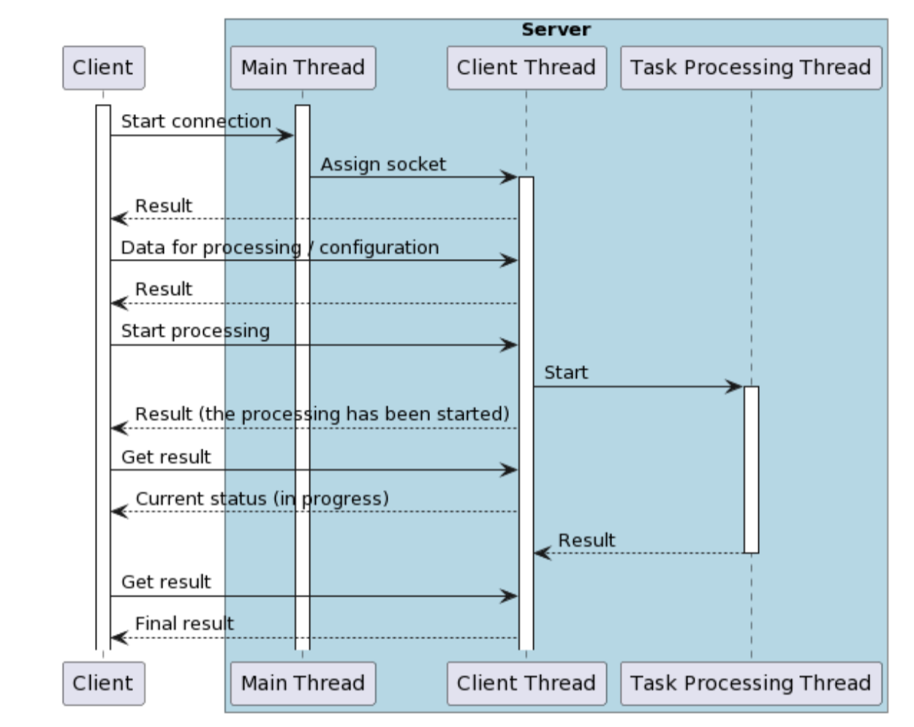

# pc-lab5

This is basically a fork of https://github.com/emilia-miki/pc-lab4. The only
significant changes are to the server, which is now mostly asynchronous, and
some application protocol changes described below.

A parallel computing lab. The task is to create a client-server application
that works over the TCP protocol. The application protocol should be custom.
The server should accept matrices from clients on different threads, transpose
the matrices using multiple threads without blocking further request processing
for the client, and sent the results back to the client if the client sent a 
"get status" request and the matrix is available. The server shouldn't use async,
because that is the next lab's task --- to rewrite the task processing part of
this server using futures/promises.



The [client](client) is both a TCP server and a TCP client depending on the flags
passed to it. This is useful to allow for usage like this:
```
$ ./client --daemon
{ json data, including the daemon port, which is used as id below }
$ ./client --id=7878 --command=reserve --type=u8 --dimension=100
{ json request }
{ json response with an assigned task index }
$ ./client --id=7878 --command=calc --job-id=1
{ json request }
{ json response }
$ ./client --id=7878 --command=poll --job-id=1
{ json request }
{ json response }
$ ./client --id=7878 --command=close
$ 
```

The [server](server) is written according to the provided architecture. Main
highlights:
- [main.rs](server/src/main.rs) file handles incoming connections on a single
thread, spawning a new thread for each connection.
- [threads.rs](server/src/thread.rs) handles a client connection.
- [job.rs](server/src/job.rs) handles client tasks.
- [request.rs](server/src/request.rs) contains these two notable functions:
  - from_stream - reads the TCP stream and parses the request
  according to the application protocol;
  - execute - calls the JobManager in the appropriate way for the request
  and returns back the response.
- [response.rs](server/src/response.rs) has a send function that encodes
the request according to the application protocol and writes it to the TCP
stream.
- Everything is asynchronous and running on the Tokio runtime, except the
thread pool for matrix transposition, which is managed by rayon and integrated
into the rest of the application with a wrapper function process_tasks and
a few tokio channels.

The application protocol is as follows:
- The client must initiate communication with a request and wait to receive
a response.
- The server waits for requests and sends back one response after receiving
one request.
- The client must not send new requests before receiving a response for the
previous one (undefined behavior).
- The first byte of any message is the message code:
  - 0 - reserve,
  - 1 - calc
  - 2 - poll
  - 3 - error
  The error code 3 is only valid for responses.
- reserve request:
  - the second byte must be a matrix type code, encoded as follows:
    - 0 - u8
    - 1 - u16
    - 2 - u32
    - 3 - u64
    - 4 - i8
    - 5 - i16
    - 6 - i32
    - 7 - i64
    - 8 - f32
    - 9 - f64
  - the third to sixth bytes are a 32-bit number indicating the matrix dimension
  (one is enough, because the server does matrix transposition and all the matrices
  have to be square matrices)
- reserve response:
  - the first 8 bytes are the task ID, which can be used to send the other 
  requests for this task. If the memory wasn'e reserved, the server will send
  and error response instead
- calc request:
  - the first 8 bytes are the task ID
  - the following bytes are the matrix data itself, row by row
- calc response:
  - there is no further payload except the message code.
  - if the provided index is not assigned to any tasks, the server returns an error
  response instead.
- poll request:
  - the first 8 bytes are the task ID.
- poll response
  - the first byte is the status code:
    - 0 - no data
    - 1 - reserved
    - 2 - running
    - 3 - completed
  - if the status code is 3, the following bytes are the matrix data, row by row.
- error response
  - the first byte is the length of the error message
  - the following bytes are the message itself, UTF8-encoded

